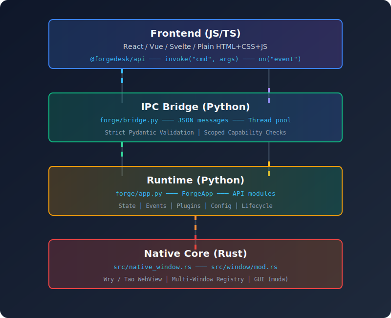

## What is Forge?

**Forge** is a next-generation desktop application framework that unites Python 3.10+ (including the new 3.13/3.14 free-threaded runtime) with modern web technologies (React, Vue, Svelte, etc.) and a lightweight Rust-based native core. It lets you build **fast, secure, and maintainable** desktop applications.

Think of it as **"Tauri for Python"**. It combines the native OS integration and footprint efficiency of Rust (`wry`/`tao`) with the unparalleled developer productivity and ecosystem of Python.

## Core Design Philosophy

### 1. **Python-First Backend**
- Write core business logic in **Python** with full access to the PyPI ecosystem.
- Leverage **NumPy**, **Pandas**, **PyTorch**, and millions of other libraries directly natively.
- Use Python type hints to automatically generate frontend TypeScript definitions.

### 2. **Any Frontend**
- Use **React**, **Vue**, **Svelte**, **Astro**, **Angular**, **SolidJS**, or plain HTML/CSS/JS.
- Keep your single-file components, hot module replacement (HMR), and modern Vite-based tooling.
- Achieve desktop-grade UI performance by using the OS-provided WebView, eliminating the need to bundle Chromium.

### 3. **Lightweight & Secure**
- Uses native OS WebViews (WebKit on macOS, WebView2 on Windows, WebKitGTK on Linux).
- Minimal memory and binary footprint (typically under 20MB without the Python interpreter bundled).
- **Deny-by-default security model**: explicitly enable only the capabilities and permissions your app needs via `forge.toml`.
- IPC payloads are strictly validated using Pydantic on the backend.

### 4. **Zero-Copy & Native Performance**
- **No JavaScript bottleneck** for heavy workloads. Moving megabytes of data? Use our `forge-memory://` protocol to stream zero-copy bytes between Python and the WebView.
- The Rust core handles the OS event loop, ensuring the UI remains perfectly responsive even when Python is crunching heavy data.

## Architecture at a Glance

## Key Capabilities

### Backend Capabilities
- ✅ **Command Registration**: `@app.command` decorator exposes Python functions as strict IPC endpoints.
- ✅ **Event Streaming**: `app.events.emit("event", data)` pushes updates to the frontend in real-time.
- ✅ **Zero-Copy Buffers**: Share massive byte arrays safely without Base64 encoding via `app.memory.buffers`.
- ✅ **Hardware & Serial**: Native access to USB/Serial ports via the built-in `Hardware API`.
- ✅ **System Integration**: Deep hooks into the OS for tray icons, global shortcuts, and lifecycle matching.
- ✅ **Background Tasks**: Built-in thread and async task pools for non-blocking operations.

### Frontend Capabilities
- ✅ **Type-Safe IPC Invocation**: `invoke("command", args)` calls Python securely.
- ✅ **Event Listening**: `listen("event", callback)` subscribes to backend updates.
- ✅ **Hot Reloading**: Uninterrupted DX. Save a Python or TS file, and it instantly reloads.
- ✅ **Framework Agnostic**: Works perfectly with whatever frontend bundler you prefer.

### System Integration
- 🖥️ **Multi-Window**: Manage complex window hierarchies, z-indexes, and transparency from Python.
- 🔑 **Keychain**: Securely store user credentials in the native OS credential manager.
- 🔔 **Notifications**: Trigger rich native OS notifications.
- 📁 **File System**: Sandbox-aware file and directory operations with strict glob rules.

## Comparison to Other Frameworks

| Framework | Backend Language | Frontend | Bundle Size | UI Renderer | Direct PyPI Access |
|-----------|------------------|----------|-------------|-------------|--------------------|
| **Forge** | Python 3.10+ | Any JS framework | 15-30MB | OS WebView | **Yes** ✅ |
| Electron | Node.js | Any JS framework | 150MB+ | Chromium | No ❌ |
| Tauri | Rust | Any JS framework | 10-20MB | OS WebView | No ❌ |
| PyQt/PySide | Python | Qt Widgets / QML | 80MB+ | Qt (C++) | **Yes** ✅ |
| Textual/Streamlit | Python | Pre-built Web | 50MB+ | Browser | **Yes** ✅ |

## Why Forge?

**For Python Developers / Data Scientists:**
You can finally build beautiful, interactive desktop apps without learning C++, Qt, or Rust. You can ship your Pandas/NumPy pipelines as standalone executables with a sleek React UI.

**For Web Developers:**
Keep the modern web ecosystem you love while gaining the ability to execute heavy background tasks, access local hardware, and utilize the AI/ML ecosystem of Python natively.

**For Enterprise Teams:**
Ship lightweight, secure internal tools. Manage updates securely and maintain a deny-by-default permission model that satisfies InfoSec requirements.

## Next Steps

- **[Getting Started](/getting-started/)** — Build your first app in 5 minutes.
- **[Architecture Deep Dive](/architecture/)** — Understand the Rust ↔ Python ↔ JS bridge.
- **[Complete API Reference](/api-complete-reference/)** — Explore all built-in APIs and capabilities.
- **[Deployment & Security](/deployment-security/)** — Learn how to lock down your app before release.
